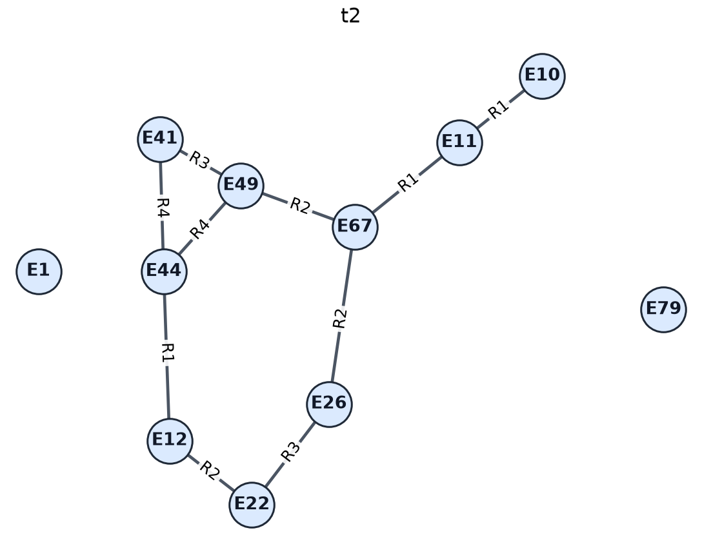
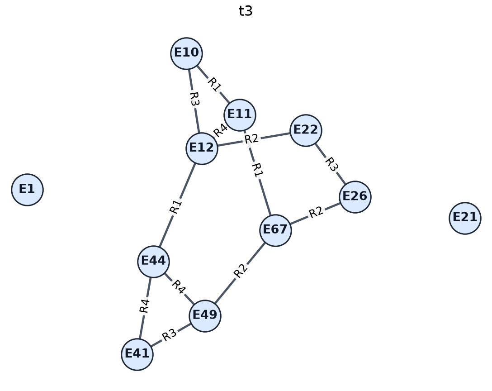

# MVGraph: Benchmarking LVLMs on Evidence Composition across Multi-View Visual Graph

MVGraph is a benchmark for evaluating whether large vision-language models (LVLMs) can recover and compose structural evidence distributed across multiple node-link graph images. It covers two settings:

- **Partial graph views:** each image reveals only part of a larger graph, so the model must align overlapping entities and compose the views before answering.
- **Temporal graph views:** the images show a graph at different time steps, so the model must track structural changes and reason over their consequences.

This repository provides **370 sample instances** for inspecting the dataset format, task design, graph images, structured annotations, and reference answers. It is an example release rather than the complete benchmark.

## Dataset overview

The sample release covers 37 tasks organized into four diagnostic stages and one end-to-end evaluation track.

| Track | Role | Tasks | Samples |
| --- | --- | ---: | ---: |
| Perception | Parse every visual graph view into structured nodes and edges | 1 | 10 |
| Alignment | Align nodes and complete edge triples across views or time | 10 | 100 |
| Composition | Organize and combine evidence distributed across views | 8 | 80 |
| Reasoning | Solve graph and counterfactual problems from prepared structural evidence | 10 | 100 |
| Graph-theoretic reasoning | Solve graph-theoretic problems end to end from multiple images | 8 | 80 |
| **Total** |  | **37** | **370** |

The distinction between the final two tracks is important: `reasoning` isolates inference after task-relevant structure has been made explicit, while `graph_theoretic_reasoning` requires the model to extract and compose the visual evidence before solving the problem.

## Task taxonomy

### Perception

- `P` — Graph Parsing

### Alignment

- `A-AE` / `A-AN` — Added Edges / Added Nodes
- `A-PE` / `A-PN` — Persistent Edges / Persistent Nodes
- `A-RE` / `A-RN` — Removed Edges / Removed Nodes
- `A-SE` / `A-SN` — Shared Edges / Shared Nodes
- `A-VSE` / `A-VSN` — View-Specific Edges / View-Specific Nodes

### Composition

- `C-CD` — Component Decomposition
- `C-EV` — Essential Views
- `C-MVS` — Minimal View Set
- `C-PA` — Path Assembly
- `C-PP` — Persistent Path
- `C-TPC` — Temporal Path Composition
- `C-UE` / `C-UN` — Union Edge Count / Union Node Count

### Reasoning diagnostics

- `R-BM` — Bipartite Matching
- `R-BN` — Bridge Node Criticality
- `R-CE` — Causal Edge Identification
- `R-HP` — Hamiltonian Path
- `R-MF` — Maximum Flow
- `R-MFC` — Maximum Flow Change
- `R-SBM` — Stable Bipartite Matching
- `R-STS` — Stable Topological Sorting
- `R-THP` — Time-Respecting Hamiltonian Path
- `R-TS` — Topological Sorting

### End-to-end graph-theoretic reasoning

- `BM` — Bipartite Matching
- `HP` — Hamiltonian Path
- `MF` — Maximum Flow
- `MFC` — Maximum Flow Change
- `SBM` — Stable Bipartite Matching
- `STS` — Stable Topological Sorting
- `THP` — Time-Respecting Hamiltonian Path
- `TS` — Topological Sorting

## Example

The following two images come from an alignment example. The same `E*` label identifies the same node across time, while an edge is identified by its complete `[head, relation, tail]` triple.

<p align="center">
  
  
</p>

The question asks which edge triples were added from `t2` to `t3`. The expected model output is:

```json
{
  "answer": [
    ["E10", "R3", "E12"],
    ["E11", "R4", "E12"]
  ]
}
```

## Data organization

```text
dataset_examples/
├── perception/
├── alignment/
├── composition/
├── reasoning/
└── graph_theoretic_reasoning/
    ├── all_generated_samples.json
    ├── metadata.jsonl
    ├── summary.json
    └── samples/
        └── <task_name>/
            └── <sample_id>/
                ├── sample.json
                ├── images/
                └── graphs/
```

Each track contains:

- `all_generated_samples.json`: a compact inference index with sample IDs, task information, image paths, questions, reference answers, and metadata paths.
- `metadata.jsonl`: complete metadata with one sample per line.
- `summary.json`: sample counts for the track and its tasks.
- `samples/<task_name>/<sample_id>/sample.json`: full metadata for one instance, including its question, answer, difficulty information, validation results, and underlying graph data.
- `images/`: the ordered graph views shown to the model in visual-input tracks. Structure-prepared reasoning instances encode the relevant graph evidence in the question instead.
- `graphs/`: machine-readable graph representations corresponding to the images.

Paths stored in `all_generated_samples.json` are relative to the directory of their track. A compact record has the following form:

```json
{
  "id": "a-ae_000072",
  "task_id": "A-AE",
  "task_name": "added_edges",
  "image_paths": [
    "samples/a-ae_added_edges/000072/images/t1.png",
    "samples/a-ae_added_edges/000072/images/t2.png",
    "samples/a-ae_added_edges/000072/images/t3.png"
  ],
  "question": "...",
  "answer": [
    ["E10", "R3", "E12"],
    ["E11", "R4", "E12"]
  ],
  "metadata_path": "samples/a-ae_added_edges/000072/sample.json"
}
```

## Representation and construction

- Visual-input instances contain an ordered sequence of 2–8 graph images; the end-to-end graph-theoretic tasks use 2–4 views. Temporal order is retained when the question depends on graph evolution.
- Structure-prepared `reasoning` instances contain no image input. They expose the task-relevant graph structure or composition evidence textually in order to isolate the reasoning stage.
- Nodes use semantically neutral identifiers such as `E1`, and reusable relation types use identifiers such as `R1`. A relation identifier is not a globally unique edge ID; the complete `(head, relation, tail)` triple identifies an edge.
- Layouts are computed independently for each view. A recurring node can therefore appear at different positions across images, preventing coordinate matching from replacing structural alignment.
- Diagnostic graphs are undirected. In the graph-theoretic tasks, topological sorting and maximum flow use directed graphs, while bipartite matching and Hamiltonian path tasks use undirected graphs.
- Maximum-flow edges additionally display positive integer capacities.
- Each individual image contains 7–20 nodes. The union of all views can contain more nodes.
- Questions and reference answers are generated from the underlying graph structures. Samples are checked for structural validity, task constraints, answer validity, and cross-view evidence requirements where applicable.
